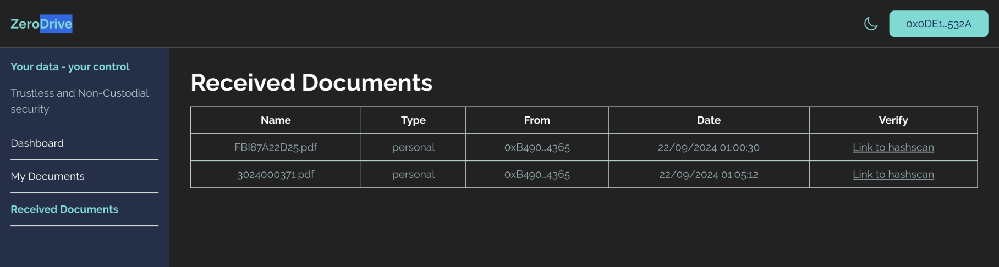

# About

A never-before-seen Web2 drive called zeroDrive. Store and access your confidential data in purely non-custodial and trustless way.

## Getting Started on local 

To run daap locally, you will need

- Node.js (v18 or above)
- Chrome Browser Or Chromium based browser
- Metamask Extension on Chrome Browser (Chromium based browser)

# back-end

1. clone this repo

```
git clone https://github.com/rahulEth/zerodrive.git
```

2.  go to api folder

```
cd api
```

3. copy .env.example to .env 

4. setup all the environment variables including moralis ipfs key, app-wallet private key
& wallet address, mongodb url.

5. 
```
npm install

npm run start

```
server would start on localhost:3000

# front-end

1. go into frontend folder

```
cd frontend

copy .env.example to .env 

npm install

npm run build

npm run dev

```
Open [http://localhost:5173](http://localhost:5173) with your browser to see the result.


Ta-da You are good to go and explore zeroDrive dApp!





## Description

zeroDrive is a web based app designed to store and access users' Web2 confidential data in a trustless and non-custodial way. When users secure their files, zeroDrive prompts them to provide their [https://metamask.io] (metamask) or [https://docs.reown.com/appkit/overview] (walletconnect) signature to encrypt and store the file data. We issue a proof of security on the Hedera blockchain, allowing users to verify and ensure the safety of their data. No one other than the user can view or access the file data, as everything is encrypted by user's MetaMask/WalletConnect wallet signature.

Also we are utilizing [https://docs.sign.global](sign protocol) if user wants to notarize and transfer the file to other user. first user will authenticate himself with metamask/walletconnect and zeroDrive will act as notary on user behalf.


## Secure File Flow


## Access File Flow


## sign protocol flow


## Deployed Contract for Trsutless-Pass dapp on Hedera Blockchain

### ZerodriveProof

- https://hashscan.io/testnet/contract/0.0.4883541

### sign protocol Schema

https://testnet-scan.sign.global/schema/onchain_evm_84532_0x2cb


